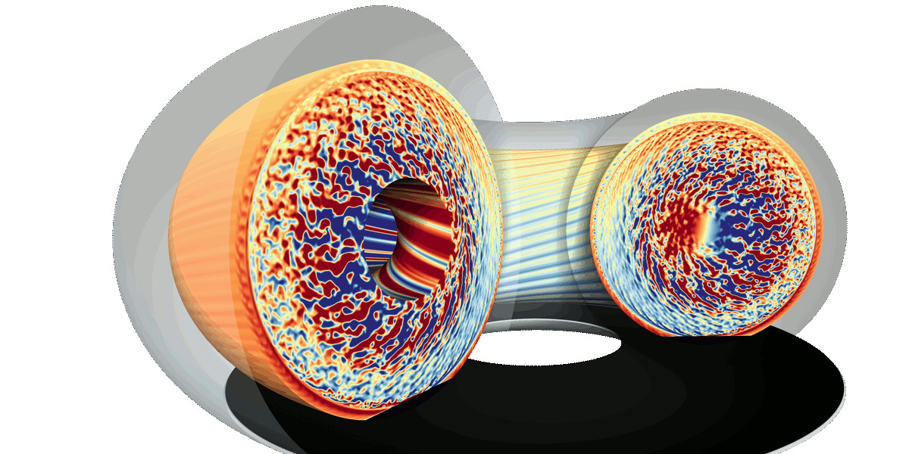

# Gyselalib++

Gyselalib++ is a library that provides functionality for solving kinetic and gyrokinetic problems on exascale computing architectures.

The theoretical approach and implementation details builds on the following paper:

- V. Grandgirard et al. (2016). A 5D gyrokinetic full-f global semi-lagrangian code for flux-driven ion turbulence simulations. [*Computer Physics Communications*](https://doi.org/10.1016/j.cpc.2016.05.007)
[[PDF]](https://www.sciencedirect.com/science/article/pii/S0010465516301230/pdfft?casa\_token=0aLVJvOU6QQAAAAA:UneLQCHIYkJRk6F42an3hTNCuDZzMYZcppUKK\_nRRXWdMaQYgm6PlyqN08ZGFm8ZXhw2qDy1pQ&md5=fd256637e0ef6f45653879c233b579ff&pid=1-s2.0-S0010465516301230-main.pdf)

A list of Gysela related publications can be found here: [Publications](
https://gyselax.github.io/publication/)

## First steps

- If you want to install Gyselalib follow: [installation](docs/first_steps/install.md).
- [Getting Started with Gyselalib](docs/first_steps/getting_started.md).

## Questions?

Contact the [GYSELA-X Team](https://gyselax.github.io/)
