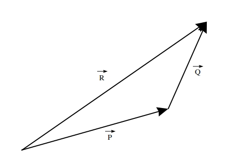

# Using DDC in Gyselalib++

[DDC](https://github.com/Maison-de-la-Simulation/ddc) is a library which aims to provide types which represent mathematical/physical concepts.
Representing these concepts with types allows the compiler to enforce the mathematical validity of expressions.

The DDC library is based on templates. The template parameters are based on physical dimensions.

When using DDC the first step is therefore to create structures representing each of the physical dimensions, e.g. `X`. These objects should only contain one attribute, a static constexpr boolean called `PERIODIC` which indicates whether the dimension is periodic or not.
The DDC types are then parametrised by this structure. The dimension is in real space and is continuous.

The following sections describe some of the DDC types used in Gyselalib++.

## Contents

- [Coordinates](#coordinates)
- [Indexing and associated concepts](#indexing-and-associated-concepts)
  - [Grid](#grid)
  - [Index](#index)
  - [Index Step](#index-step)
  - [Index Range](#index-range)
- [Data Storage](#data-storage)
- [Example](#example)
- [Pitfalls](#pitfalls)

## Coordinates

A `Coord` in Gysela is an alias to the DDC type `ddc::Coordinate`. It is one of the only DDC types which represents a continuous data type. This means that it can take any value that can be represented by a double. It represents the position of a coordinate in the vector space.

Coordinates can have 1 or more dimension. E.g. the coordinate of a position on a $(r,\theta)$ slice should have the type `Coord<R, Theta>`, where `R` represents the radial dimension $r$, and `Theta` represents the poloidal dimension $\theta$.

If the value of the coordinate needs to be used in a mathematical expression, the scalar (`double`) quantity stored in one of the dimensions of a coordinate can be extracted using `ddc::get<DimOfInterest>(my_coord)`.

It is also possible to extract a coordinate on a subset of the original dimensions using `ddc::select<DimOfInterest>(my_coord)`. For example if we want to get the position of an object on a radial slice $(r,\theta)$, but we are given the coordinate in the full vector space $`(r, \theta, \varphi, v_\parallel, \mu)`$ then we can do:

```cpp
Coord<R, Theta, Phi, Vpar, Mu> full_coord(...);
Coord<R, Theta> slice_coord = ddc::select<R, Theta>(full_coord);
```

Coordinates can be combined using operators. For example, let us consider three vectors $P$, $Q$, and $R$ defined on a cartesian space $(x,y)$:



The vector $Q$ can be written as $Q=R-P$. Similarly in the code, we would have:

```cpp
Coord<X, Y> P(5.0, 2.0);
Coord<X, Y> R(7.0, 6.0);
Coord<X, Y> Q = R - P;
```

The `Coord` class also provides an addition operator, comparison operators, and an output operator for easy printing using `cout`.

In Gyselalib++ the alias `CoordX` is usually defined in `geometry.hpp` to describe the type `Coord<X>` more succinctly.

## Indexing and associated concepts

The physical problems that our simulations describe are defined on a domain. The domain on which the problem is defined is continuous (e.g. a radial domain $[0,1)$). However a simulation evolves on a grid. This means that the value of the function is only known at a discrete set of points. In the case of a function $f(x)\rightarrow y \in \mathbb{R}$ with $x \in [0,1)$, we would usually discretise the domain $[0,1)$ as follows:
$$
x_0, x_1, ..., x_i, ..., x_N
$$

DDC provides multiple types to represent the concepts required to index elements of arrays defined on this grid or to get the coordinates of the grid.

## Grid

The points $`\{x_0, ..., x_N\}`$ form the grid on which the simulation evolves. This sampling can either be uniform or non-uniform. Accordingly DDC provides 2 classes for which Gysela provides the following type aliases:

- `UniformGridBase` (the type alias of `ddc::UniformPointSampling`)
- `NonUniformGridBase` (the type alias of `NonUniformPointSampling`)

A uniform point sampling is a collection of points which are equidistant, it is therefore defined with an origin and a step or distance between consecutive points. In contrast the points found in a non-uniform point sampling are arbitrary. This kind of sampling must therefore be initialised from a list of points.

It is possible to have multiple grids defined on the same dimension (e.g. the grid points used for a Gauss-Legendre quadrature, the grid points on which the simulation evolves, the grid points which split a spline into polynomials, etc). In order for each grid that is defined to have a different type DDC requires that we define structures which inherit from `UniformGridBase` and `NonUniformGridBase` (these structures are then the base structures from which we inherit). In Gyselalib++ such structures have the keyword `Grid` in the name (e.g. `GridX`) and are usually defined in `geometry.hpp`.

E.g.:

```cpp
struct GridX : UniformGridBase<X>
{
};
```

Although this seems like a useful type, you should not directly create instances of this class in the code. Instead you should call `init_discrete_space` and access the points using an `Index`. For more details see the section about `Index`.

## Index

In order to interact with most types in Gyselalib++ we need to use an `Idx` (a type alias for `ddc::DiscreteElement`). This type describes an index of a point in the grid. E.g. the point `x_i` in the grid `GridX` can be indexed using the object `Idx<GridX>(i)`.
An `Idx` is therefore roughly equivalent to an integer. Compared to an integer, it additionally contains information about the physical direction being examined. This allows the compiler to raise errors if typos/copy-paste errors lead to the wrong dimension being used.

In Gyselalib++ the alias `IndexX` is usually defined in `geometry.hpp` to describe the index of the grid along the dimension X on which the distribution function is discretised.

We can also create multi-dimensional indices. E.g. the point `(x_i, y_j)` can be indexed using the object `Idx<GridX, GridY>(i, j)`

It is also possible to extract an index on a subset of the original dimensions using `ddc::select<GridOfInterest>(my_nd_index)`.

Once a grid has been initialised using the function `ddc::init_discrete_space`, an `Idx` defined on that grid can be used to obtain the coordinates of the points in the grid. This is done using the function `ddc::coordinate`.

E.g:

```cpp
Coord<R> r_min(0.0);
Coord<R> r_max(1.0);
IdxStep<R> r_ncells(10);
ddc::init_discrete_space<GridR>(r_min, r_max, r_ncells);
Idx<GridR> i(0); // The first point in the grid
std::cout << ddc::coordinate(i) << std::endl;
```

will output:

```none
(0.0)
```

## Index Step

An `IdxStep` (type alias for `ddc::DiscreteVector`) describes the number of steps to get from one point in a grid to another. E.g. `x_3` and `x_6` are separated by `IdxStep<GridX>(3)`.

This type is useful when we have the index of a point and we need to get the next point. An `IdxStep` can be added or subtracted from an `Idx` as long as both objects are templated by the same dimension. Similarly an `IdxStep` is the result of subtracting 2 `Idx`s.

E.g:

```cpp
Idx<GridX> i(4);
Idx<GridX> j(6);
IdxStep<GridX> k = j-i;
i += k;
```

In Gyselalib++ the alias `IdxStepX` is usually defined in `geometry.hpp` to describe the step from one element of a grid along the dimension X to another.

As with `Idx`s, an `IdxStep` can be multi-dimensional and lower dimension `IdxStep` objects can be extracted using `ddc::select<GridOfInterest>(my_nd_vector)`.

For a more concrete example of how this type is useful see [Example](#example).

## Index Range

The last concept necessary to define the grid on which a simulation evolves is the concept of index ranges. The class `IdxRange` is designed to describe the indices on which a field is defined. This may be all or only a subset of the indices comprising the grid.

Each index range is described by:

- An origin : This is the `Idx` which indicates the first point in the domain.
- A size : This is a `IdxStep` indicating the number of elements in each dimension.

For example if we consider the 2D grid: $`[x_0, ..., x_N] \times [y_0, ... y_M]`$, the index range would be described as:

```cpp
Idx<GridX, GridY> origin(0, 0);
IdxStep<GridX, GridY> size(N, M);
IdxRange<GridX, GridY> idx_range(origin, size);
```

Similarly the section of the grid: $`[x_i, ..., x_j] \times [y_k, ... y_l]`$ would be described as:

```cpp
Idx<GridX> i_index(i);
Idx<GridX> j_index(j);
Idx<GridY> k_index(k);
Idx<GridY> l_index(l);
Idx<GridX, GridY> origin(i_index, k_index);
IdxStep<GridX, GridY> size((j_index-i_index), (l_index-k_index));
IdxRange<GridX, GridY> idx_range(origin, size);
```

When working with index ranges we do not usually know if we have access to all of the grid or just a subset. It is therefore important to use the `get_index_range` function to traverse fields rather than initialising elements manually as we don't know the index of the first element of a `IdxRange` at compile time.

There are multiple functions available for traversing an index range. Most of the time we will traverse the entire index range. This can be done simply as `IdxRange` implements the functions `begin()` and `end()`. These functions are called automatically using the modern C++ syntax for a for element in list, or using the `ddc::for_each` function. The latter is to be preferred as it will allow us to add parallelism later. The syntax is:

```cpp
for (Idx<GridX> index : idx_range) {
}
```

or:

```cpp
ddc::for_each(idx_range, [&](Idx<GridX> index) {
});
```

In the case of a `ddc::for_each` the second argument is a lambda function. The `[&]` ensures that any variable defined outside the loop are captured by reference so they can be used inside the lambda function.

It is also common to need to iterate over a subset of grid points. Such a subset can be created using the syntax described above, however `IdxRange` also contains several helper functions which are designed to facilitate the creation of these sets:

- `take_first(IdxStep<..> n)` : Returns an index range containing only the first n indices of the original range.
- `take_last(IdxStep<..> n)` : Returns an index range containing only the last n indices of the original range.
- `remove_first(IdxStep<..> n)` : Returns an index range containing all but the first n indices of the original range.
- `remove_last(IdxStep<..> n)` : Returns an index range containing all but the last n indices of the original range.
- `remove(IdxStep<..> n_first, IdxStep<..> n_last)` : Returns an index range containing all indices of the original range except the first n\_first indices and the last n\_last indices.

It is also possible to extract a lower-dimensional index range from an ND index range using `ddc::select<GridOfInterest>(my_nd_idx_range)`.

Finally it may not be possible to express the elements you want to iterate over as an index range. This is notably the case if you want to iterate over every j-th element. In this case it is necessary to fall back on `IdxRangeIterator`. The syntax in this case is:

```cpp
for (IdxRangeIterator<GridX> it=idx_range.begin(); it < idx_range.end(); it += j) {
    Idx<GridX> index = *it;
}
```

In addition to the iteration functionalities, `IdxRange` also has other useful functions. The following is a non-exhaustive list of useful functions:

- `front()` : Returns the first `Idx` in the domain.
- `back()` : Returns the last `Idx` in the domain.
- `size()` : Returns the total number of points in the domain (the product of the number of points in each dimension).
- `extents()` : Returns the number of points in each dimension stored in an `IdxStep`.

In Gyselalib++ the alias `IdxRangeX` is usually defined in `geometry.hpp` to describe the index range containing points from `GridX`.

## Data Storage

Data is allocated at the instantiation of a `FieldMem` (type alias for `ddc::Chunk`). This type is parametrised by the underlying data type (e.g. `double`), and the `IdxRange` on which the values are defined. By default in Gysela memory is allocated on the device (GPU).

In order to initialise the data storage to the correct size, a `FieldMem` is initialised by providing the `IdxRange` on which the values are defined.

In Gyselalib++ the alias `FieldMemX` is usually defined in `geometry.hpp` to describe the memory block for a field defined on the all or part of `GridX`.. E.g:

```cpp
FieldMemXVx<double> distribution_function_2d_alloc(idx_range_x_vx);
```

In Gyselalib++ the functions are almost all defined using real numbers. The additional alias `DFieldMemX` is therefore defined to represent a real function defined on all or part of `GridX`. E.g:

```cpp
DFieldMemRThetaPhiVparMu distribution_function_2d_alloc(idx_range_radial_poloidal_toroidal_velocity_mu);
```

As instantiating a `FieldMem` leads to data allocation using this type always has an associated cost. In order to avoid accidental copying DDC is structured such that the only way to copy data from one `FieldMem` to another is using the function `ddc::deepcopy`. Using an assignment or initialising from another `FieldMem` will result in a compiler error.

To avoid copying data unnecessarily, DDC provides the type `Field` (type alias for `ddc::ChunkSpan`). This can be thought of as a reference to a `FieldMem`. It may at first seem surprising that a new type is required for this as a more typical approach would be to use `const&`. However when code runs on a GPU a new instance of each variable must be created on the GPU. This is necessary to avoid race conditions and to ensure locality. We do not want all the data in the `FieldMem` to be copied to/from the GPU every time a kernel is started, so instead we use `Field` which only copies a pointer to the GPU memory to the new variable instance.

Unless you need to allocate data, you should always use `Field` rather than `FieldMem`. A `Field` can be obtained from a `FieldMem` using the constructor of `Field` or the global function `get_field`.

In Gyselalib++ the alias `FieldX` is usually defined in `geometry.hpp` to describe a reference to a function defined on the domain or sub-domain containing points from the point sampling `GridX`. E.g:

```cpp
FieldMemXVx<double> distribution_function_2d_alloc(idx_range_x_vx);
FieldXVx<double> distribution_function_2d(distribution_function_2d_alloc);
```

As for `FieldMem` an additional alias `DFieldX` is defined to simplify the notation for doubles.

Finally we also define the aliases `ConstFieldX` and `DConstFieldX` to represent constant versions of `FieldX` and `DFieldX`. These objects are used for function arguments when the contents of the array must not be altered. As they are aliases, not new objects, all the same functions that work for `Field` can also be used for `ConstField`. A `ConstField` can be obtained from a field using the function `get_const_field`.

:warning: Beware a `DConstFieldX` is not equivalent to a `DFieldX const`. The latter indicates only that the field will always be associated with the same `FieldMem` object. Its contents can still be modified.

A `Field` is indexed using either multiple 1D `Idx`s, or one ND `Idx`. As the `Idx`s contain information about the dimension on which they act it is not necessary to pass these arguments in a specific order. Thus the following two functions are equivalent:

```cpp
double get_element_1(DFieldXVx my_chunk, IdxX i, IdxY j) {
    return my_chunk(i, j);
}

double get_element_2(DFieldXVx my_chunk, IdxX i, IdxY j) {
    return my_chunk(j, i);
}
```

This is particularly useful if we don't know the layout order of the data and will allow us to reorder this data without changing the way we interact with the chunk.

Finally a `Field` also implements a `[]` operator. A `Field` does not have to reference the entire memory block stored in the associated `FieldMem`. The `[]` operator can be passed an `IdxRange` to create a `Field` which only references part of the `FieldMem`. This is especially useful for accessing slices. In this case a simpler syntax exists, where we only need to pass the index of the slice. For example, if we wish to get a $(r, \theta)$ slice from a distribution function defined in $`(r, \theta, \varphi, v_\parallel, \mu)`$ we would do the following:

```cpp
DFieldMem<IdxRange<GridR, GridTheta, GridPhi, GridVpar, GridMu>> distribution_function_alloc(idx_range);
DField<IdxRange<GridR, GridTheta, GridPhi, GridVpar, GridMu>> distribution_function(distribution_function_alloc);
Idx<GridPhi, GridVpar, GridMu> index;
DField<IdxRange<GridR, GridTheta>> distribution_function_slice = distribution_function[index];
```

## Example

Let us consider the following system of equations (a simple Vlasov-Poisson system):
$$
\left[\partial_t + \frac{1}{\sqrt{m_s}} \left(v\partial_x - q_s \partial_x \phi(t,x)\partial_v\right)\right] f_s(t,x,v) = 0\\
\partial_x^2\phi(t,x) = - \sum_s q_s \int f_s(t,x,v) dv\\
f_s(0,x,v) = \frac{n_0}{2\pi T_0}\exp\left(-\frac{v^2}{T_0}\right)\cos(k_xx)
$$

which evolves over a 2 dimensional domain defined by the dimensions $(x,v)$. The domain is $[0, 700]\times[-6,6]$.
We can also consider the species s as a discrete dimension which is defined as [i, e].

The first thing which is necessary to define our system are types describing the continuous dimensions:

```cpp
// Tag to represent the x-dimension
struct X {
    static bool constexpr PERIODIC = true;
}

// Tag to represent the v-dimension
struct Vx {
    static bool constexpr PERIODIC = false;
}
```

We also need types to define the grid on which the simulation will evolve. The domain is discretised on the following grid: $`[i, e]\times[x_0,...,x_N]\times[v_0,...,v_{N_v}]`$. Grid types are required to define the positions of the grid points in each of the three dimensions:

- The object $`[x_0,...,x_N]`$ is defined with a grid and will be denoted $GridX$.
- The object $`[v_0,...,v_{N_v}]`$ is defined with a grid and will be denoted $GridVx$.
- The object $['i', 'e']$ is defined as a `SpeciesInformation` collection and will be denoted $Species$.

With these objects defined, the index range(s) can then be created. The index range for the distribution function has the type: `IdxRange<Species, GridX, GridVx>` however for simplicity it is denoted `IdxRangeSpXVx`. The electric potential $\phi$ has a smaller domain with the type `IdxRange<GridX>` denoted `IdxRangeX`.

Other index ranges may be useful to work on slices of data or on subdomains (e.g. if we distribute our function using MPI).

The data itself will be stored in `FieldMem`s and accessed with `Field`s. For example the distribution function will be stored in a `DFieldMem<IdxRange<Species, GridX, GridVx>>`. To improve readability this type is denoted `DFieldMemSpXVx`. Similarly the electric potential will be stored in a `DFieldMemX`.

The other types will be useful when interacting with the data. For example, in order to initialise the distribution function we need to loop over the grid using the coordinates and an `Idx<Species, GridX, GridVx>` (denoted `IdxSpXVx` for simplicity) to fill the array:

```cpp
IdxRangeSpXVx idx_range(..);
DFieldMemSpXVx distribution_function_alloc(idx_range);
DFieldSpXVx distribution_function(distribution_function_alloc);

ddc::for_each(idx_range, [&](IdxSpXVx index) {
    CoordXVx coord = ddc::coordinate(ddc::select<GridX, GridVx>(index));
    double v_pos = ddc::get<Vx>(coord);
    double x_pos = ddc::get<X>(coord);
    distribution_function(index) = n0 / (2 * M_PI * T0) * exp(-v_pos * v_pos / T0) * cos(kx * x_pos);
});
```

### Continuous vs. discrete objects

The majority of the DDC types represent objects in or on a discrete vector space. It may not be immediately obvious why continuous objects are also needed given that simulations are necessarily discrete. Backward semi-Lagrangian advection is a good example of where this is required. In backward semi-Lagrangian advection we work on a discrete grid (accessed via an `IdxRange`), for each point of the grid we trace the characteristic to find where a particle positioned at this grid point would have been located at the previous time step. This location, known as the foot of the characteristic can be located anywhere in the vector space, unlike the grid points, the foot of the characteristic is not restricted to a subset of valid positions. It must therefore be represented with a continuous object. In this case a `Coord` perfectly describes the position of the foot of the characteristic while also providing all pertinent information about the dimensions.

### Example use of Index Step for Finite Differences

The class `IdxStep` is particularly useful in cases where we wish to express a stencil. Let us consider the case of a 2D finite differences scheme on uniform meshes expressed as follows:
$$
\nabla^2 f(x,y) = \frac{f(x-h_x, y) + f(x+h_x, y) + f(x, y-h_y) + f(x, y+h_y) - 4f(x,y)}{h_x h_y}
$$

This code can be written simply using `Idx` and `IdxStep`:

```cpp
double get_laplacian_at_position(DFieldXY function_values, IndexXY position)
{
    IdxStepX x_step(1);
    IdxStepY y_step(1);

    // Get the uniform grid in the appropriate direction and use it to
    // extract the distance h.
    double h_x = ddc::discrete_space<X>().step();
    double h_y = ddc::discrete_space<Y>().step();

    return (function_values(position - x_step) + function_values(position + x_step)
            + function_values(position - y_step) function_values(position + y_step)
            - 4 * function_values(position))
           / (h_x * h_y);
}
```

As you can see DDC takes care of combining elements and vectors to ensure that the resulting `IdxXY` is in the correct position. This makes it simpler to write such stencils and easier to spot errors, especially in cases involving lots of dimensions.

## Pitfalls

When using DDC there are some things that you should be careful about. These are listed here.

### Synchronicity

In DDC and Kokkos the code runs asynchronously when an execution space is provided. When no execution space is provided the code runs synchronously surrounded by fences. In order to ensure that there is no danger coming from the asynchronicity we need to follow certain rules. In Gysela the chosen conventions are:

- Always provide an execution space to `ddc::parallel_for_each` or `ddc::parallel_transform_reduce` (or similar Kokkos functions).
- Only provide an execution space to `create_mirror_view_and_copy` when this is unavoidable (i.e. when copying to the `DefaultExecutionSpace`). The `DefaultHostExecutionSpace` should never be passed to `create_mirror_view_and_copy`.
