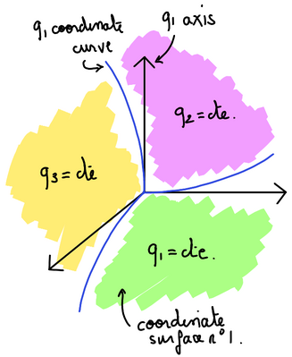
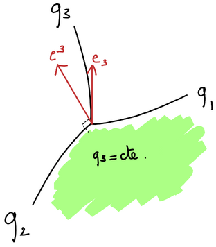

# Mathematical and physical conventions

The conventions adopted in gyselalibxx for describing physical quantities such as scalar fields, vector fields and tensors are detailed hereafter. 

## Contents

-  [On the use of curvilinear coordinates](#docs_mathematical_and_physical_conventions__On_the_use_of_curvilinear_coordinates)
-  [Metric tensor](#docs_mathematical_and_physical_conventions__Metric_tensor)
-  [Jacobian](#docs_mathematical_and_physical_conventions__Jacobian)
-  [Differential operators](#docs_mathematical_and_physical_conventions__Differential_operators)

## On the use of curvilinear coordinates

Let us consider a system of coordinates denoted by $`\{q^i\}_{ i \in [1, N]}`$, where $`i`$ is an integer quantity and $`N`$ is the dimension of the space mapped by the $`\{q^i\}`$ coordinates. For the sake of simplicity we use in the following the compact $`\{q^i\}`$ notation to denote the set $`\{q^i\}_{ i \in [1, N]}`$. The $`\{q^i\}`$ coordinate system can be derived from Cartesian coordinates---that we denote by $`\{x^i\}`$--- from the invertible transformation 

```math
q^i = q^i(x^1, \ldots , x^N) \quad \forall i \in [1, N].
```

Note that even though an inverse of the functions $`q^i(x^1, \ldots , x^N)`$ must exist so that the coordinate transform is valid, it is not always possible to write an explicit formula for such inverse. The surface defined by $`q^i = \text{constant}`$ is called a *coordinate surface*, the intersection of these surfaces define *coordinate curves*. A *coordinate axis* is locally defined as the axis tangent to a given coordinate curve. As their name suggests, coordinate curves do not form straight lines in general. An illustration for these geometrical concepts is given in the following figure.



The position of any point in space can be written as

```math
\overrightarrow{r} = x^i e_i,
```

where we introduced the unit vectors of the orthonormal Cartesian bases $`\{e_i\}`$. The position vector $`\overrightarrow{r}`$ is not to be confused with the radial coordinate $`r`$. We rely on the Einstein summation in the above equation and in the following, i.e. we consider that repeated indices indicate a summation. See the [wikipedia page on Einstein summation](https://en.wikipedia.org/wiki/Einstein_notation) for more details.

## Contravariant and covariant bases
Let us define the *contravariant bases* $`\{b_i\}`$ associated to the $`\{q^i\}`$ coordinates by

```math
b_i = \frac{\partial \overrightarrow{r}}{\partial q^i} = \frac{\partial x^j}{\partial q^i} e_j,
```

and the *covariant bases* $`\{b^i\}`$ by

```math
b^i = \nabla q^i = \frac{\partial q^i}{\partial x^j} e_j.
```

These two bases are *local bases*, in the sense that the $`b_i`$ and $`b^i`$ vectors depend on the considered position in space, i.e. 
we have $`b_i(x^1, \ldots , x^N)`$ and $`b^i(x^1, \ldots , x^N)`$. A geometrical interpretation of these two bases reads as follows. The *covariant* unit vector $`b^i`$ is orthogonal to the coordinate surface $`q^i = \text{constant}`$, while the *contravariant* unit vector $`b_i`$ is locally tangent to the coordinate curve associated with the $`q^i`$ coordinate. This is the situation depicted in the following picture.




Note that neither contravariant nor covariant bases form orthonormal vector sets in general. Additionally note that in the case of Cartesian coordinates covariant and contravariant bases are the same. In general, the following property holds 
```math
b^i \cdot b_j = \delta_{ij}, 
```

with $`\cdot`$ the dot product operator and the Kronecker delta $`\delta_{ij} = 1`$ if $`i= j`$, and $`\delta_{ij} = 0`$ otherwise. Let us now consider a vector $`A`$. This vector may be expressed in either contravariant or covariant bases as

```math
A = A_i b^i = A^i b_i, 
```

Where 
- $`\{A_i\}`$ are the components of $`A`$ in *the covariant bases*. We call these *the covariant components* of $`A`$;
- $`\{A^i\}`$ are the components of $`A`$ in *the contravariant bases*. We call these *the contravariant components* of $`A`$;

## Metric tensor

The *metric tensor* $`G`$ associated with the set of coordinates $`\{q^i\}`$ is defined from its components $`g_{ij}`$ as

```math
g_{ij} = b_i \cdot b_j,
```

and the *inverse metric tensor* $`G^{-1}`$, whose components are written as $`g^{ij}`$, is defined as

```math
g^{ij} = b^i \cdot b^j.
```

A property of the metric tensor is that it can be used to transform contravariant components of a vector into covariant components and conversely, as 

```math
\begin{aligned}
A_i =& g_{ij}A^j, \\
A^i =& g^{ij}A_j.
\end{aligned}
```

An easy way to get the above formulas right is to remember that the metric tensor can be used to "raise" or "lower" indices. 

## Jacobian

### Curvilinear to Cartesian

The *Jacobian* $`J`$ associated with the transformation from the curvilinear coordinates $`\{q^i\}`$ to the Cartesian coordinates $`\{x^i\}`$ is defined from its components $`J\left.^{i}_{\;j}\right.`$ as 

```math
J\left.^{i}_{\;j}\right. = \frac{\partial x^i}{\partial q^j},
```

while the inverse Jacobian $`J^{-1}`$ is defined by its components $`J^{-1}\left.^{i}_{\;j}\right.`$ as 

```math
J^{-1}\left.^{i}_{\;j}\right. = \frac{\partial q^i}{\partial x^j}.
```

Both Jacobian and metric tensor relate to each other as

```math
G = J^{T}J.
```

The Jacobian of a curvilinear coordinate transformation can be used to relate the components of a vector expressed in the Cartesian bases $`\{e_i\}`$ to the components of the vector expressed in the contravariant bases $`\{b_i\}`$ associated with the curvilinear coordinate system. More precisely, let us write a vector $`A`$ as 

```math
A = A^i_\text{c} e_i = A^i b_i, 
```

Where the "c" subscript indicates that the considered components is computed in the Cartesian bases. It can be shown using the chain rule that the following equality holds

```math
A^i_\text{c} = J\left.^{i}_{\;j}\right. A^j. 
```

Note that relating the components of the vector $`A`$ expressed in the covariant bases is less straightforward as this involves the metric tensor, i.e.  

```math
A^i_\text{c} = J\left.^{i}_{\;j}\right. g^{jk}A_k. 
```

### Curvilinear to curvilinear

Let us now consider the more general case where one seeks to relate two curvilinear coordinate system $`\{q^i\}`$ and $`\{p^i\}`$. We denote by $`J\{q\to p\}`$ the Jacobian of the transformation from the coordinate system $`\{q^i\}`$ to $`\{p^i\}`$. The components of the Jacobian and of its inverse are defined similarly as above as 

```math
J\left.^{i}_{\;j}\right.\{q\to p\} = \frac{\partial p^i}{\partial q^j}, \quad J^{-1}\left.^{i}_{\;j}\right.\{p\to q\} = \frac{\partial q^i}{\partial p^j}. 
```

Here one may note that $`J^{-1}\left.^{i}_{\;j}\right.\{p\to q\} = J\left.^{i}_{\;j}\right.\{q\to p\}`$. Let us now write $`\{b_i\}`$ (resp. $`\{b^i\}`$) the contravariant (resp. covariant) vector bases associated with coordinates $`\{q^i\}`$, and $`\{c_i\}`$ (resp. $`\{c^i\}`$) the contravariant (resp. covariant) vector bases associated with coordinates $`\{p^i\}`$. Let us now express a vector $`A`$ in these bases as 

```math
A = A^i\{p\} b_i = A_i\{p\} b^i = A^i\{q\} c_i = A_i\{q\} c^i, 
```

where $`A^i\{p\}`$ (resp. $`A_i\{p\}`$) refers to the $`i`$-th contravariant (resp. covariant) component of $`A`$ expressed in the vector bases associated with coordinates $`\{p^i\}`$, and similarly $`A^i\{q\}`$ (resp. $`A_i\{q\}`$) refers to the $`i`$-th contravariant (resp. covariant) component of $`A`$ expressed in the vector bases associated with coordinates $`\{q^i\}`$. We have

```math
A^i\{p\} = J\left.^{i}_{\;j}\right.\{q\to p\} A^j\{q\}. 
```

By introducing the metric tensors $`G\{p\}`$  and $`G\{q\}`$ associated with both curvilinear coordinates system, and by writing $`g_{ij}\{p\}`$ and $`g_{ij}\{q\}`$ their elements ($`g^{ij}\{p\}`$ and $`g^{ij}\{q\}`$ the elements of their inverse) one relates the components of $`A`$ expressed in covariant vector bases associated with both curvilinear coordinates system as 

```math
g^{ik}\{p\}A_k\{p\} = J\left.^{i}_{\;j}\right.\{q\to p\}g^{jl}\{p\} A_l\{q\}. 
```

## Differential operators

Hereafter are expressed differential operators in a curvilinear coordinate system $`\{q^i\}`$. 

### Gradient

Let us consider a scalar field $`f`$. The gradient $`\nabla f`$ of such field is defined in the Cartesian bases $`\{e_i\}`$ as

```math
\nabla f = \frac{\partial f}{\partial x^i} e_i. 
```

This quantity can be expressed in the both contravariant $`\{b_i\}`$ and covariant $`\{b^i\}`$ vector bases as

```math
\nabla f = \frac{\partial f}{\partial q^i} b^i = g^{ij} \frac{\partial f}{\partial q^j} b_i. 
```

Note that the definition that uses the contravariant bases $`\{b_i\}`$ is much more common. 

### Divergence

**TODO**


### Curl

**TODO**
