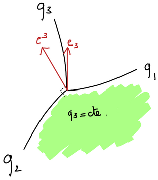

# Mathematical and physical conventions

The conventions adopted in Gyselalib++ for describing physical quantities such as scalar fields, vector fields and tensors are detailed hereafter.

## Contents

- [On the use of curvilinear coordinates](#on-the-use-of-curvilinear-coordinates)
- [Metric tensor](#metric-tensor)
- [Jacobian](#jacobian)
- [Differential operators](#differential-operators)

## On the use of curvilinear coordinates

Let us consider a system of coordinates denoted by $`\{q^i\}_{ i \in [1, N]}`$, where $`i`$ is an integer quantity and $`N`$ is the dimension of the space mapped by the $`\{q^i\}`$ coordinates. For the sake of simplicity we use in the following the compact $`\{q^i\}`$ notation to denote the set $`\{q^i\}_{ i \in [1, N]}`$. The $`\{q^i\}`$ coordinate system can be derived from Cartesian coordinates---that we denote by $`\{x^i\}`$--- from the invertible transformation

```math
q^i = q^i(x^1, \ldots , x^N) \quad \forall i \in [1, N].
```

Note that even though an inverse of the functions $`q^i(x^1, \ldots , x^N)`$ must exist so that the coordinate transform is valid, it is not always possible to write an explicit formula for such inverse. One *i coordinate surface* is defined as $`q^i = \text{constant}`$ . One *i coordinate curve* is defined as the intersection of a series of j coordinate surfaces $`\forall j \in [1, N]`$ with $` j\neq i`$. A *i coordinate axis* is defined as the tangent of the "i coordinate curve". As their name suggests, coordinate curves do not form straight lines in general. An illustration for these geometrical concepts is given in the following figure.


The position of any point in space can be written as

```math
\overrightarrow{x} = x^i \mathbf{e}_i,
```

where we introduced the unit vectors of the orthonormal Cartesian basis $`\{\mathbf{e}_i\}`$. The position vector $`\overrightarrow{x}`$ is not to be confused with the radial coordinate $`r`$. We rely on the Einstein summation in the above equation and in the following, i.e. we consider that repeated indices indicate a summation. See the [wikipedia page on Einstein summation](https://en.wikipedia.org/wiki/Einstein_notation) for more details.

## Contravariant and covariant bases

Let us define the *contravariant basis* $`\{\mathbf{b}_i\}`$ associated to the $`\{q^i\}`$ coordinates by

```math
\mathbf{b}_i = \frac{\partial \overrightarrow{x}}{\partial q^i} = \frac{\partial x^j}{\partial q^i} \mathbf{e}_j,
```

and its dual basis, the *covariant basis* $`\{\mathbf{b}^i\}`$ by

```math
\mathbf{b}^i = \nabla q^i = \frac{\partial q^i}{\partial x^j} \mathbf{e}_j.
```

These two bases are *local bases*, in the sense that the $`\mathbf{b}_i`$ and $`\mathbf{b}^i`$ vectors depend on the considered position in space, i.e.
we have $`\mathbf{b}_i(x^1, \ldots , x^N)`$ and $`\mathbf{b}^i(x^1, \ldots , x^N)`$. A geometrical interpretation of these two bases reads as follows. The *covariant* unit vector $`\mathbf{b}^i`$ is orthogonal to the coordinate surface $`q^i = \text{constant}`$, while the *contravariant* unit vector $`\mathbf{b}_i`$ is locally tangent to the coordinate curve associated with the $`q^i`$ coordinate. This is the situation depicted in the following picture.



Note that neither contravariant nor covariant bases form orthonormal vector sets in general. Additionally note that in the case of Cartesian coordinates covariant and contravariant bases are the same. In general, the following property holds

```math
\mathbf{b}^i \cdot \mathbf{b}_j = \delta_{ij},
```

with $`\cdot`$ the dot product operator and the Kronecker delta $`\delta_{ij} = 1`$ if $`i= j`$, and $`\delta_{ij} = 0`$ otherwise. Let us now consider a vector $`\mathbf{A} \in \mathbb{R}^N`$. This vector may be expressed in either covariant or contravariant bases as

```math
\mathbf{A} = A_i \mathbf{b}^i = A^i \mathbf{b}_i,
```

Where

- $`\{A_i\}`$ are the components of $`\mathbf{A}`$ in *the covariant basis*. We call these *the covariant components* of $`\mathbf{A}`$;
- $`\{A^i\}`$ are the components of $`\mathbf{A}`$ in *the contravariant basis*. We call these *the contravariant components* of $`\mathbf{A}`$;

## Multi-dimensional tensors

Just as vectors can be expressed on either the covariant or contravariant bases, multi-dimensional tensors can also be expressed on both bases.
The basis of a multi-dimensional tensor is the tensor product of 1D bases.

For example, a 2D tensor can be written in any of the following four forms:

```math
M = m^{ij} \mathbf{b}_i \otimes \mathbf{b}_j = m^{i}_{\;j} \mathbf{b}_i \otimes \mathbf{b}^j = m_{i}^{\;j} \mathbf{b}^i \otimes \mathbf{b}_j = m_{ij} \mathbf{b}^i \otimes \mathbf{b}^j
```

This notation is useful as it provides a visual reminder of what element-wise operations are valid. When writing a tensor multiplication we must always follow the following rules:

- Each index should appear at most twice in the equation (to avoid confusion).
- When an index is repeated, one instance should be associated with a covariant component while the other should be associated with a contravariant component.

In order to see the reason for this let us consider a matrix-vector product between a matrix $M$ and a vector $\overrightarrow{r}$ ($M\overrightarrow{r}$).
If we write everything on the contravariant basis then we obtain:

```math
M\overrightarrow{r} = m^{ij}\mathbf{b}_i\otimes\mathbf{b}_j r^k\mathbf{b}_k = (m^{ij}r^k (\mathbf{b}_j\cdot\mathbf{b}_k)) \mathbf{b}_i
```

in order to calculate this we must calculate 3 terms: $m^{ij}$, $r^k$, and $`\mathbf{b}_j \cdot \mathbf{b}_k`$. However if we write the vector on the covariant basis we can use the property mentioned above ($`\mathbf{b}^i \cdot \mathbf{b}_j = \delta_{ij}`$) to simplify this:

```math
M\overrightarrow{r} = m^{ij}\mathbf{b}_i\otimes\mathbf{b}_j r_k\mathbf{b}^k = (m^{ij}r_k (\mathbf{b}_j\cdot\mathbf{b}^k)) \mathbf{b}_i = m^{ij}r_j \mathbf{b}_i
```

### Transpose of a multi-dimensional tensor

A transpose operation is equivalent to changing which dimension is represented by which basis. Thus for a tensor expressed on two 1D bases $\mathbf{b}^i$ and $`\mathbf{c}_j`$:

```math
M = m_{i}^{\;j} \mathbf{b}^i \otimes \mathbf{c}_j
```

the transpose expressed using the same components will be defined as:

```math
M^T = m_{i}^{\;j} \mathbf{c}_j \otimes \mathbf{b}^i
```

element-wise a transpose operation can therefore be written as:

```math
(M^T)^i_{\;j} = m\left._{j}^{\;i}\right.
```

## Metric tensor

The *metric tensor* $`G`$ associated with the set of coordinates $`\{q^i\}`$ is defined from its components $`g_{ij}`$ as

```math
g_{ij} = \mathbf{b}_i \cdot \mathbf{b}_j,
```

and the *inverse metric tensor* $`G^{-1}`$, whose components are written as $`g^{ij}`$, is defined as

```math
g^{ij} = \mathbf{b}^i \cdot \mathbf{b}^j.
```

A property of the metric tensor is that it can be used to transform contravariant components of a vector into covariant components and conversely, as

```math
\begin{aligned}
A_i =& g_{ij}A^j, \\
A^i =& g^{ij}A_j.
\end{aligned}
```

An easy way to get the above formulas right is to remember that the metric tensor can be used to "raise" or "lower" indices.

## Jacobian

### Curvilinear to Cartesian

The *Jacobian* matrix $`J`$ associated with the transformation from the curvilinear coordinates $`\{q^i\}`$ to the Cartesian coordinates $`\{x^i\}`$ is defined from its components $`J\left.^{i}_{\;j}\right.`$ on the basis $`\mathbf{e}_i \otimes \mathbf{b}^j`$ as:

```math
J\left.^{i}_{\;j}\right. = \frac{\partial x^i}{\partial q^j},
```

while the inverse Jacobian $`J^{-1}`$ is defined by its components $`J^{-1}\left.^{i}_{\;j}\right.`$ on the basis $`\mathbf{b}_j \otimes \mathbf{e}_i`$ as

```math
J^{-1}\left.^{i}_{\;j}\right. = \frac{\partial q^i}{\partial x^j}.
```

As shown above, the Jacobian matrix and its inverse are not expressed in the same basis. Indeed, the inverse Jacobian of the transformation $`\{q^i\} \rightarrow \{x^j\}`$ is equivalent to the Jacobian of the transformation $`\{x^i\} \rightarrow \{q^j\}`$. As such it uses the basis on which the Jacobian of the transformation $`\{x^i\} \rightarrow \{q^j\}`$ would usually be expressed.

The metric tensor associated with the basis $`b_i`$ can be obtained from the Jacobian of the transformation $`\{x^i\} \rightarrow \{q^j\}`$ via the following equation:

```math
G = J^{T}J.
```

The Jacobian of a curvilinear coordinate transformation can be used to relate the components of a vector expressed in the Cartesian basis $`\{\mathbf{e}_i\}`$ to the components of the vector expressed in the contravariant basis $`\{\mathbf{b}_i\}`$ associated with the curvilinear coordinate system. More precisely, let us write a vector $`\mathbf{A}`$ as

```math
\mathbf{A} = A^i_\text{c} \mathbf{e}_i = A^i \mathbf{b}_i,
```

Where the "c" subscript indicates that the considered components is computed in the Cartesian basis. Note that we used the contravariant basis in the expression above. It can be shown using the chain rule that the following equality holds

```math
A^i_\text{c} = J\left.^{i}_{\;j}\right. A^j.
```

Note that relating the components of the vector $`\mathbf{A}`$ expressed in the covariant basis is less straightforward as this involves the metric tensor, i.e.

```math
A^i_\text{c} = J\left.^{i}_{\;j}\right. g^{jk}A_k.
```

however a simplification can be made using the fact that $G=J^TJ$, thus $G^{-1}=J^{-1}J^{-T}$ (where $J^{-T}$ represents the transpose of the inverse of the Jacobian) and $JG^{-1} = JJ^{-1}J^{-T} = J^{-T}$. Thus the components of the vector $`\mathbf{A}`$ expressed in the covariant basis $`\{\mathbf{b}^i\}`$ can be related to the components of the vector $`\mathbf{A}`$ expressed in the Cartesian basis as:

```math
A^i_\text{c} = {A_i}_\text{c} = (J^{-T})_i^{\;j} A_j = (J^{-1})^j_{\;i} A_j
```

Note that in the above expression the $`J^{-T}`$ tensor has been expressed in the $`\mathbf{e}_i \otimes \mathbf{b}_j`$ basis.

### Curvilinear to curvilinear

Let us now consider the more general case where one seeks to relate two curvilinear coordinate systems $`\{q^i\}`$ and $`\{p^i\}`$. Let us also write $`\{\mathbf{b}_i\}`$ (resp. $`\{\mathbf{b}^i\}`$) the contravariant (resp. covariant) vector basis associated with coordinates $`\{q^i\}`$, and $`\{\mathbf{c}_i\}`$ (resp. $`\{\mathbf{c}^i\}`$) the contravariant (resp. covariant) vector basis associated with coordinates $`\{p^i\}`$.
We denote by $`J_{\{q\to p\}}`$ the Jacobian of the transformation from the coordinate system $`\{q^i\}`$ to $`\{p^i\}`$. The components of the Jacobian on the basis $`\mathbf{c}_i \otimes \mathbf{b}^j`$ and the components of its inverse on the basis $`\mathbf{b}_i \otimes \mathbf{c}^j`$ are defined similarly to above, as:

```math
(J_{\{q\to p\}})^{i}_{\;j} = \frac{\partial p^i}{\partial q^j}, \quad (J_{\{q\to p\}})^{-1}\left.^{i}_{\;j}\right. = \frac{\partial q^i}{\partial p^j}.
```

Here one may note that $`(J_{\{q\to p\}})^{-1}\left.^{i}_{\;j}\right. = (J_{\{p\to q\}})^{i}_{\;j}`$.  Let us now express a vector $`\mathbf{A}`$ in these bases as

```math
\mathbf{A} = A^i_{\{p\}} \mathbf{b}_i = A_{\{p\}i} \mathbf{b}^i = A^i_{\{q\}} \mathbf{c}_i = A_{\{q\}i} \mathbf{c}^i,
```

where $`A^i_{\{p\}}`$ (resp. $`A_{\{p\}i}`$) refers to the $`i`$-th contravariant (resp. covariant) component of $`\mathbf{A}`$ expressed in the vector basis associated with coordinates $`\{p^i\}`$, and similarly $`A^i_{\{q\}}`$ (resp. $`A_{\{q\}i}`$) refers to the $`i`$-th contravariant (resp. covariant) component of $`\mathbf{A}`$ expressed in the vector basis associated with coordinates $`\{q^i\}`$. We have

```math
A^i_{\{p\}} = (J_{\{q\to p\}})^{i}_{\;j} A^j_{\{q\}}.
```

By introducing the metric tensors $`G_{\{p\}}`$  and $`G_{\{q\}}`$ associated with both curvilinear coordinates system, and by writing $`g_{\{p\}ij}`$ and $`g_{\{q\}ij}`$ their elements ($`g^{ij}_{\{p\}}`$ and $`g^{ij}_{\{q\}}`$ the elements of their inverse) one relates the components of $`\mathbf{A}`$ expressed in the covariant vector bases associated with both curvilinear coordinates system as:

```math
g^{ik}_{\{p\}}A_{\{p\}k} = (J_{\{q\to p\}})^{i}_{\;j}g^{jl}_{\{q\}} A_{\{q\}l}.
```

The metric tensor associated with the basis $`\mathbf{c}_i`$ can be obtained from the Jacobian of the transformation $`\{q^i\} \rightarrow \{p^j\}`$ and the metric tensor associated with the basis $`b_j`$ via the following equation:

```math
g_{{il}\{p\}} = (J_{\{q\to p\}})^T\left._{i}^{\;j}\right. g_{\{q\}jk} (J_{\{q\to p\}})\left.^{k}_{\;\;l}\right. = (J_{\{p\to q\}})\left.^{j}_{\;\;i}\right. g_{\{q\}jk} (J_{\{p\to q\}})\left.^{k}_{\;\;l}\right.
```

The metric tensor associated with the basis $`\mathbf{b}_i`$ can be obtained from the Jacobian of the transformation $`\{p^i\} \rightarrow \{q^j\}`$ and the metric tensor associated with the basis $`\mathbf{c}_j`$ via the following equation:

```math
g_{il}\{q\} = (J_{\{p\to q\}})^T\left._{i}^{\;j}\right. g_{\{p\}jk} (J_{\{p\to q\}})\left.^{k}_{\;\;l}\right. = (J_{\{q\to p\}})^{-1}\left.^{j}_{\;\;i}\right. g_{\{p\}jk} (J_{\{q\to p\}})^{-T}\left.^{k}_{\;\;l}\right.
```

These expressions can be used to relates the components of $`\mathbf{A}`$ expressed in the covariant vector bases associated with both curvilinear coordinates system in another way. Using the above expressions we can see that $`J_{\{q\to p\}}G_{\{q\}}^{-1}=G_{\{p\}}^{-1}J_{\{q\to p\}}^{-T}`$. This gives us:

```math
A_{\{p\}i} = (J_{\{q\to p\}})^{-T}\left._{\;\;i}^j\right. A_{\{q\}j} = (J_{\{q\to p\}})^{-1}\left.^j_{\;\;i}\right.A_{\{q\}j} = (J_{\{p\to q\}})^j_{\;\;i} A_{\{q\}j}.
```

## Differential operators

Hereafter are expressed differential operators in a curvilinear coordinate system $`\{q^i\}`$. A comprehensive derivation of such formulas can be found in Taha Sochi's note [1].

### Gradient

Let us consider a scalar field $`f`$. The gradient $`\nabla f`$ of such field is defined in the Cartesian basis $`\{\mathbf{e}_i\}`$ as

```math
\nabla f = \frac{\partial f}{\partial x^i} \mathbf{e}_i.
```

This quantity can be expressed in the both covariant $`\{\mathbf{b}^i\}`$ and contravariant $`\{\mathbf{b}_i\}`$  vector basis as

```math
\nabla f = \frac{\partial f}{\partial q^i} \mathbf{b}^i = g^{ij} \frac{\partial f}{\partial q^j} \mathbf{b}_i.
```

Note that the definition that uses the contravariant basis $`\{\mathbf{b}_i\}`$ is much more common.

### Divergence

The divergence of a vector field $`\mathbf{A} = A^i \mathbf{b}_i`$ is written as

```math
\nabla \cdot \mathbf{A} = \frac{1}{\sqrt{g}}\frac{\partial}{\partial q^i} \left( \sqrt{g} A^i\right), 
```

Where $`g`$ stands for the determinant of the metric tensor. Also note that $`g = \text{det}(G) = \text{det}(J^T J) = \text{det}(J)^2`$ thus $`\sqrt{g}`$ reduces to the absolute value of the determinant of the Jacobian tensor. In the code we evaluate the above formula by writing

```math
\nabla \cdot \mathbf{A} = \frac{\partial A^i}{\partial q^i} +  \frac{1}{\sqrt{g}}A^i \frac{\partial \sqrt{g}}{\partial q^i}, 
```

So as to be able to reuse the values of the partial derivatives of $`A^i`$ between various differential operators.

## References

[1] Taha Sochi. "Tensor Calculus".
([https://arxiv.org/abs/1610.04347](https://arxiv.org/abs/1610.04347).)
arXiv (2016).
